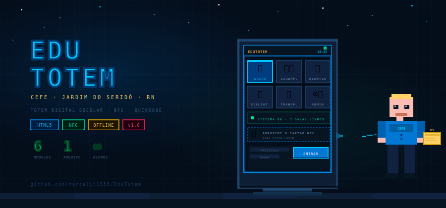

<div align="center">


# 🖥️ EduTotem

### Sistema Digital Interativo para Ambiente Escolar

**CEFE · Centro Educacional Felinto Elisio · Jardim do Seridó — RN**

---

[](https://github.com/marcelin1555/EduTotem)
[](https://github.com/marcelin1555/EduTotem)
[](https://github.com/marcelin1555/EduTotem)
[](https://github.com/marcelin1555/EduTotem)
[](LICENSE)

---

> **EduTotem** é um totem digital interativo desenvolvido para o **CEFE de Jardim do Seridó/RN**, projetado para rodar em terminais touchscreen instalados em ambiente escolar. O sistema centraliza informações para alunos e moderniza a gestão escolar — tudo em um único arquivo HTML, funcionando 100% offline.

<br/>



</div>

---

## 🆕 NOVIDADES DA VERSÃO 1.1.0

- 🚶 **Modo Visitante:** Adicionado suporte a acesso público e fácil ao totem sem necessidade de matrícula, com restrições inteligentes e seguras às áreas de Almoço e Perfil.
- 🛠️ **Revisão do Login NFC:** O simulador de espera antigo foi removido em favor do buffer de digitação inteligente que capta de forma responsiva via hardware as tags dos cartões RFID enviadas pelo módulo físico.
- 🚧 **Horários UI WIP (Glassmorphism):** A tela estática de "Horários de Aula" foi substituída por um placeholder moderno ("Em Desenvolvimento") com efeitos de pulso, iconografia animada, fundos translúcidos e gradients no estilo Glassmorphism Premium.
- ☀️ **Integração Dinâmica de Layout:** As saudações do Portal do Aluno renderizam SVG dinâmicos (Sol e Lua) baseados na hora do dia do servidor local.
- 🎨 **Consistência de Ícones:** Dependências do FontAwesome foram removidas para garantir o funcionamento local (100% offline).

---

## 📋 Índice

- [✨ Funcionalidades](#-funcionalidades)
- [🖥️ Telas do Sistema](#️-telas-do-sistema)
- [🚀 Como Usar](#-como-usar)
- [🔑 Credenciais](#-credenciais)
- [📊 Importação de Alunos](#-importação-de-alunos)
- [🔄 Sincronização](#-sincronização)
- [🧱 Estrutura do Totem Físico](#-estrutura-do-totem-físico)
- [🛠️ Tecnologias](#️-tecnologias)
- [🗺️ Roadmap](#️-roadmap)

---

## ✨ Funcionalidades

<table>
  <tr>
    <td>🔐 <strong>Login Seguro</strong></td>
    <td>Cartão NFC via Input Buffer ou matrícula + senha com sessão em LocalStorage.</td>
  </tr>
  <tr>
    <td>🍽️ <strong>Sistema de Almoço</strong></td>
    <td>Confirmação online diária com contador e limite de marcações.</td>
  </tr>
  <tr>
    <td>📋 <strong>Cardápio Semanal</strong></td>
    <td>Visualização dinâmica baseada nos dados do Painel Admin.</td>
  </tr>
  <tr>
    <td>📚 <strong>Horários de Aula (WIP)</strong></td>
    <td>Futura integração: Grade por turma e dia com badges de "Agora" em tempo real.</td>
  </tr>
  <tr>
    <td>🏫 <strong>Mapa de Salas</strong></td>
    <td>Status visual: Livre 🟢 · Ocupada 🔴 · Manutenção 🟡</td>
  </tr>
  <tr>
    <td>👤 <strong>Perfil do Aluno</strong></td>
    <td>Edição de dados demográficos, cor local de avatar, gênero e foto.</td>
  </tr>
  <tr>
    <td>⚙️ <strong>Painel Administrativo</strong></td>
    <td>Gestão completa de estudantes (CRUD) e parametrização geral.</td>
  </tr>
</table>

---

## 🖥️ Telas do Sistema

O EduTotem conta com **17 telas** organizadas em dois fluxos principais:

### 👨‍🎓 Portal do Aluno
`Login → Portal do Aluno → Almoço → Cardápio → Avisos → Horários (WIP) → Mapa de Salas → Perfil`

### ⚙️ Portal Administrativo
`Admin Login → Painel Dash → Alunos → Importar CSV → Staff → Turmas → Cardápio → Salas → Sincronização`

---

## 🚀 Como Usar

O projeto roda em modo Single-File (HTML com JS+CSS integrados). Basta abrir `index.html` em qualquer Chromium-based.

```bash
# Clone o repositório ou baixe os ZIP
git clone https://github.com/marcelin1555/EduTotem.git
cd EduTotem

# Abra o arquivo no Windows
start index.html
```

### 🖥️ Recomendação para o Totem Físico (Kiosk)
Para travar a experiência em tela cheia via atalho, use:
```cmd
chrome.exe --kiosk "C:\Caminho\Para\Arquivo\index.html" --disable-infobars --noerrdialogs
```

---

## 🔑 Credenciais Iniciais

> ⚠️ Altere as credenciais padrão após o primeiro deploy!

| Contexto | Como acessar |
|---|---|
| **Admin** | Use: M: `admin` \| P: `cefe2026` via "Login Manual" → Modo Admin |
| **Aluno** | Cadastre-se via painel admin ou importe via arquivo de backup JSON |

---

## 🧱 Construção Física Recomendada

- **Monitor Touch**: 21" - 24" capacitiva (FHD).
- **Controlador**: Mini-PC barebone (Intel Celeron ou Core i3, 4GB RAM).
- **Periferia**: Leitor de Mesa NFC (Padrão Teclado USB — ACR122U ou similares emuladores de string).
- **Cabinet ABS ou Aço**: Pintura sintética nas cores da instituição e fixador solo.

---

## 📄 Licença

Este projeto é desenvolvido para a comunidade do **CEFE Jardim do Seridó – RN** operando 100% offline visando modernização escolar simples. Licenciado via MIT License.
